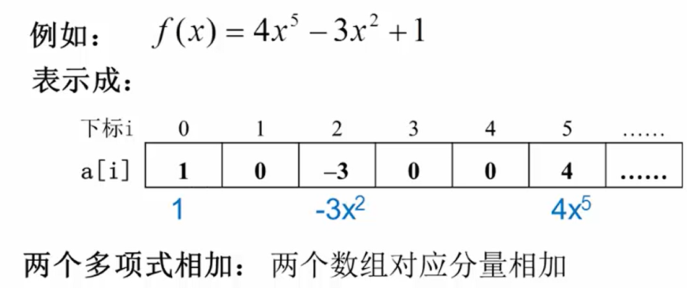
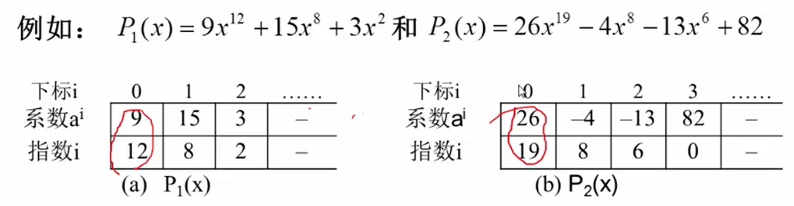
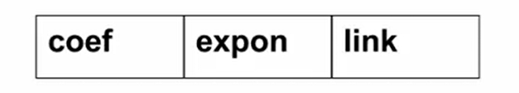
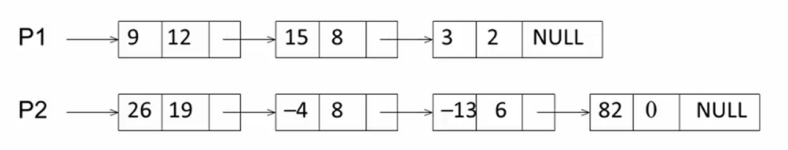
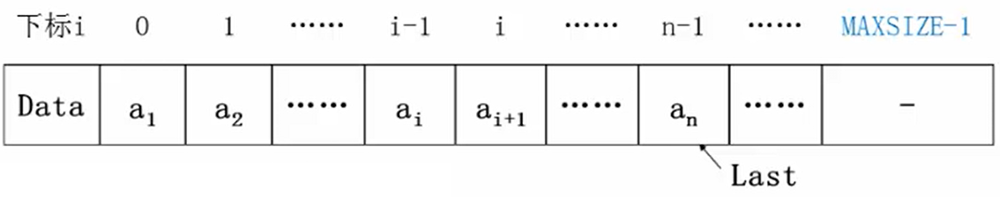

# 线性表
## 引子
### 问题：
多项式表示：多项式的项数 $n$， 各项的系数 $a_i$ 及指数 $i$。
多项式运算：相加、相减、相乘

### 方法1：顺序存储结构（数组）表示
数组分量表示多项式系数，下标表示其指数。


但，如何表示多项式 $x+3x^{2000}$ 呢？显然再用方法1就有点浪费了，因为有大量的存储空间保存了那些零。

### 方法2：顺序存储结构（数组）表示非零项
每个非零项 $a_ix^i$涉及两个信息：系数 $a_i$ 和指数 $i$
因此可以将应该多项式看成是一个二元组 $(a_i,i)$ 的集合。

**用结构数组表示**：数组分量是由系数 $a_i$ 和指数 $i$ 组成的结构体，对应一个非零项。

运算如何高效进行：**按指数大小有序存储**，例如从数组的下标低位向高位，存储指数高位到低位。

多项式相加：
两个多项式的结构体数组，依次从下标低位取出两个元素(结构体)的指数。
大的直接取出作为相加结果多项式的一项，小的与下一个比较。
相等，则两个的系数部分相加，作为结果多项式的一项。
（这个结果类似于合并两个有序的数组，归并排序的递归回归过程。）

### 方法3：链表结构存储非零项
链表中每个结点存储多项式的一个非零项，包括系数和指数两个数据域和一个指针域。

```c
typedef struct PolyNode *Polynomial;
struct PolyNode{
    int coef;
    int expon;

    Polynomial link;
}
```
例如：
$$P_1(x)=9x^{12}+15x^8+3x^2 \\ P_2(x)=26x^{19}-4x^8-13x^6+82$$
链表存储形式为：


## 定义
**线性表(Linear List)**：由同类型数据元素构成的有序序列的线性结构
- 表中元素的个数称为线性表的**长度**
- 线性表没有元素时，称为**空表**
- 表起始位置称为**表头**，表结束位置称为**表尾**

### 线性表的抽象数据类型描述
<抽象数据类型两要素：数据对象集，操作集>
类型名称：线性表(**List**)——Python中的线性表就是“列表list”

数据对象集：线性表是 $n(\geq0)$ 个元素构成的有序序列$(a_1,a_2,\dots,a_n)$

操作集：线性表 $L \in List$ ，整数 $i$ 表示位置，元素 $X \in ElementType$, 线性表基本操作主要有：
1. `List MakeEmpty();` 初始化一个空线性表
2. `ElementType FindKth(int K, List L);` 根据位序 $K$ ，返回相应元素
3. `int Find(ElementType X, List L);`在线性表 $L$ 中查找 $X$ 的第一次出现位置。
4. `void Insert(ElementType X, int i, List L);` 在位序 $i$ 前插入一个新元素 $X$
5. `void Delete(int i, List L);` 删除指定位序 $i$ 的元素
6. `int Length(List L)` 返回线性表 $L$ 的长度 $n$


### 线性表的存储方式
#### 顺序存储实现
利用数组的连续存储空间顺序存放线性表的各元素

```c
typedef struct LNode *List;
struct LNode{
    ElementType Data[MAXSIZE];
    int Last;
}
struct LNode L;
List PtrL;
```
访问下标为 $i$ 的元素：`L.Data[i]` 或 `PtrL->Data[i]`
线性表的长度：`L.Last+1` 或 `PtrL->Last+1`

#### 主要操作的实现
见代码**List(线性表 数组实现)**
